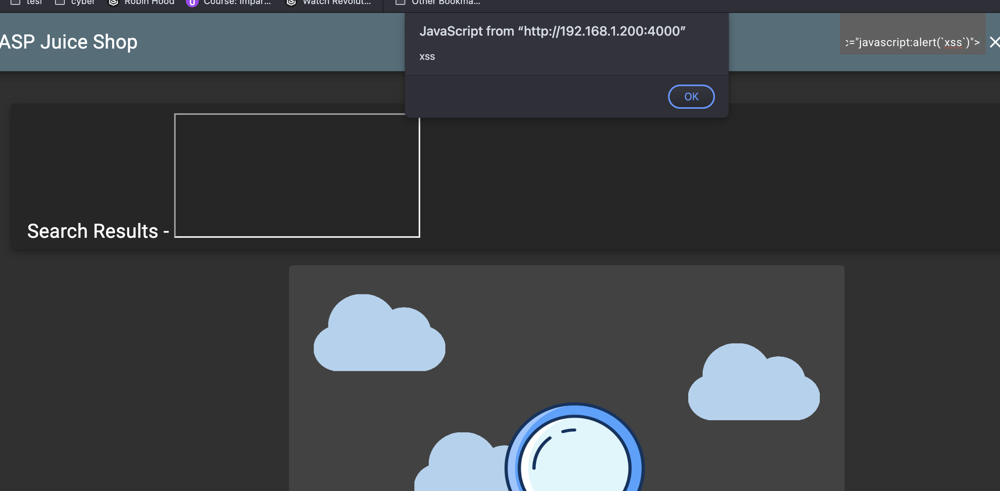
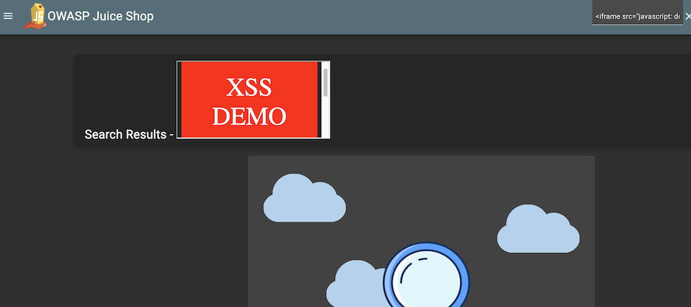

# LAB 03_IDOR

## 1. DOM XSS Attack

### 1.1 Exploitation

1. The first step was to identify a point in the application where user-controlled input is processed and rendered in the page.  
   The search functionality was selected as the most promising injection vector, since the searched term is reflected in the page content.

2. Instead of inserting a normal search string, the following XSS payload was injected into the search field: ```<iframe src="javascript:alert('xss')">```

3. After submitting the payload, a JavaScript alert window displaying the text xss appeared.
This confirms that the injected code was successfully executed in the browser context.



4. To demonstrate the potential impact of the vulnerability, a more advanced payload was used to manipulate the DOM and overwrite the page content: ```<iframe src="javascript: document.body.innerHTML = 
'<div style=\'font-size:50px;color:white;background:red;padding:40px;text-align:center;\'>XSS DEMO</div>' + 
'<p style=\'font-size:30px;text-align:center;\'>This is a demo.</p>';">```
5. This payload successfully replaced the entire page content with a large red banner displaying “XSS DEMO”, followed by a message.
This clearly shows that an attacker can arbitrarily modify the structure and content of the page.



### 1.2 Discussion (Under the Hood)

This vulnerability is classified as a DOM-based XSS because the injected payload is never processed or validated by the server.
The entire attack takes place on the client side, where JavaScript reads user-controlled input and inserts it directly into the DOM.

The search input is taken from the URL query parameter (typically q) and assigned to a DOM element that displays the searched value.
This assignment is performed using an unsafe sink such as innerHTML, which allows the browser to interpret the input as executable HTML and JavaScript.

Since no effective sanitization is applied before inserting the value into the DOM, any attacker-controlled HTML code becomes part of the page and is executed by the browser.

For this reason, the vulnerability is classified as DOM-based XSS:
- The source of the malicious input is user-controlled (the search bar / URL parameter).
- The sink is an unsafe DOM manipulation function.
- The server is not involved in the execution of the payload.
- The attack is entirely handled and triggered by client-side JavaScript.

This means that the vulnerability exists independently of any server-side processing and can be exploited simply by crafting a malicious URL or by injecting a payload through the search bar.

In other words, the application trusts user input too early and treats it as safe HTML, allowing an attacker to execute arbitrary scripts in the victim’s browser. This makes the vulnerability particularly dangerous, since it can be exploited without any interaction with the backend and can be delivered through a simple link shared with unsuspecting users.


## 2. Reflected XSS Attack

### 2.1 Exploitation

1. The first step was to identify a user-controllable input that is reflected by the application in the generated page.  
   Unlike the DOM XSS case, the goal here was to find a parameter whose value is included in the response and later rendered by the client.

2. By navigating to the *Order History* section and clicking on the truck icon associated with an order, the application redirected to the order tracking page with the following URL format: ```/track-result?id=<order-id>```

This indicated that the `id` parameter is taken from the URL and used to retrieve and display order information.

3. To verify whether this parameter was reflected without proper sanitization, the following test value was first used: http://localhost:4000/#/track-result?id=test

The value `test` was correctly processed by the application, confirming that the `id` parameter is actively used and reflected in the page logic.

4. A malicious payload was then injected by replacing the `id` value with a script-based XSS payload:

```html
<script>alert('xss')</script>
```
Resulting in the following URL:
```
http://localhost:4000/#/track-result?id=<script>alert('xss')</script>
```

5. When the page was loaded, a JavaScript alert displaying the text xss appeared.
This confirmed that the attacker-controlled input was reflected in the application response and executed in the browser context.

6. As required by the challenge specification, the same attack can also be performed using the following payload:
```
<iframe src="javascript:alert('xss')"></iframe>
```
Injected as:
```
http://localhost:4000/#/track-result?id=<iframe src="javascript:alert('xss')"></iframe>
```
7. The execution of the payload demonstrates that the id parameter is vulnerable to reflected XSS, since malicious input supplied through the HTTP request is reflected by the application and executed in the victim’s browser.


## 2.2 Discussion (Under the hood)

This vulnerability is classified as Reflected XSS because the malicious payload originates from the HTTP request and is reflected back by the application in its response.
The attacker controls the input through the id URL parameter, and this value is subsequently rendered in the page without proper sanitization.

In OWASP Juice Shop, the server receives the id parameter and uses it to retrieve order-related information.
The value is then made available to the client-side application, which inserts it into the DOM to display the tracking result.
Before being injected, the value is marked as trusted HTML using Angular mechanisms such as bypassSecurityTrustHtml, which explicitly disable built-in sanitization.

Once the value is trusted, it is assigned to a DOM element using an unsafe sink such as innerHTML.
This allows the browser to interpret the attacker-controlled input as executable HTML and JavaScript, leading to script execution.

Although the final injection into the DOM is performed by client-side JavaScript, the vulnerability is still considered reflected XSS because:

- The payload is supplied in the HTTP request.
- The server reflects this input in its response.
- The execution is a direct consequence of the reflected user input.


This behavior highlights the hybrid nature of reflected XSS in OWASP Juice Shop:
the reflection occurs at the server level, while the actual execution is triggered by unsafe DOM manipulation on the client side.

From a security perspective, this vulnerability exists because the application:

- Trusts user input without validation.
- Explicitly bypasses Angular’s sanitization mechanisms.
- Inserts attacker-controlled data into the DOM using unsafe methods.
- A proper mitigation would require:
- Strict validation of URL parameters.
- Avoiding the use of bypassSecurityTrustHtml for untrusted content.
- Encoding any user-supplied data before rendering it in the HTML.