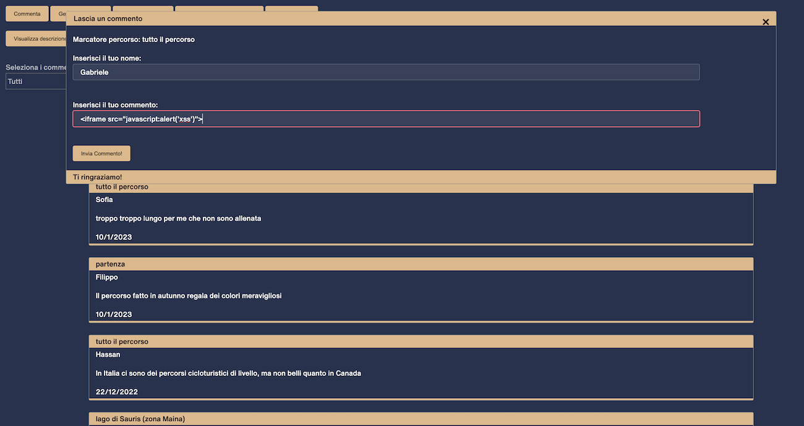
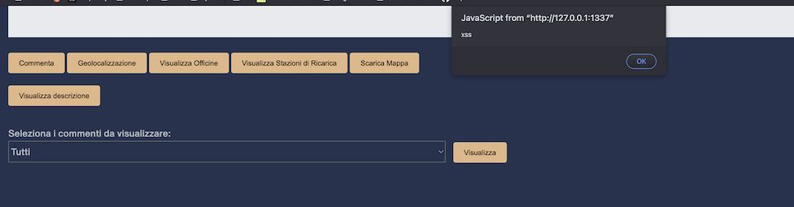
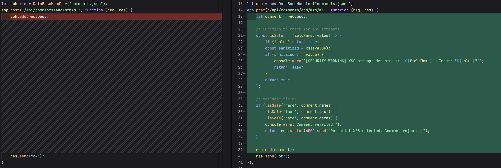
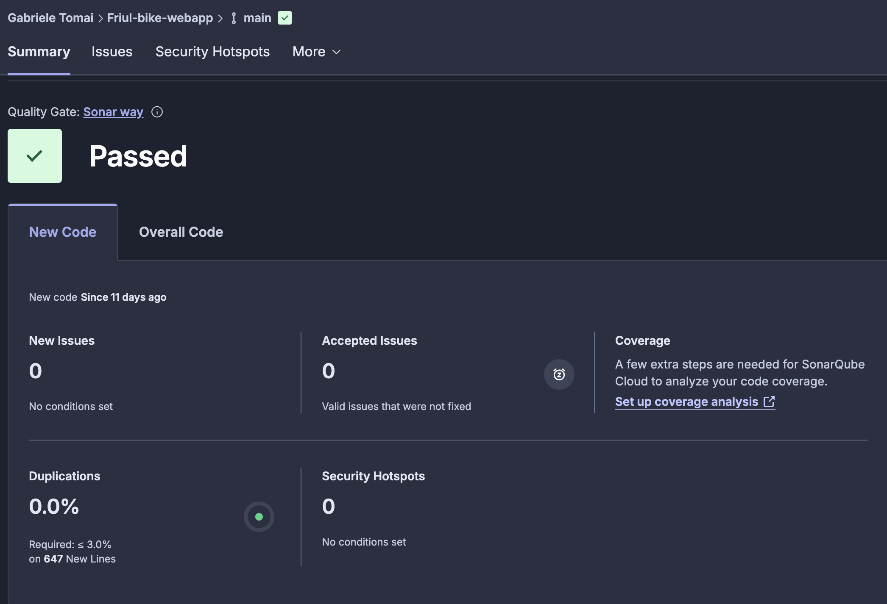

# LAB 04_XSS extra

## Stored XSS Attack
Following the study of Stored XSS vulnerabilities, I decided to assess an old personal project developed for a Web Programming course prior to acquiring cybersecurity knowledge.
The project is a Node.js-based web application that allows users to post comments regarding cycling routes in Friuli Venezia-Giulia (the project is available [here](https://github.com/Gabriele-tomai00/Friul-bike-webapp)).
The application requires users to input a name and a comment, which are subsequently displayed in a list format as cards.
By injecting a malicious payload into the comment field, such as:
```
<script>alert('xss')</script>
```


The attack successfully triggers an alert box displaying the text, and it disrupts the rendering of subsequent comments. Crucially, this behavior persists for any user accessing the web page thereafter.



The malicious comment was persistently stored in the backend (implemented as a simple JSON file in this instance):
```json
    {
        "name": "Gabriele",
        "text": "<iframe src=\"javascript:alert('xss')\">",
        "id": "1",
        "date": "1/2/2026"
    }
```
### Mitigation
#### 1. Validate input on arrival
To mitigate this vulnerability, it is imperative to sanitize user input before rendering it as HTML. This sanitation must occur on the server-side to prevent attackers from bypassing client-side restrictions by modifying JavaScript code.
The recommended approach is to utilize established and regularly maintained public libraries.
Since the application is built on Node.js, I integrated the `xss` npm package. The implementation details are shown below:



Upon re-attempting the injection of the same malicious payload, the system successfully blocked the input. The comment was not saved to the file, and the following security warning was logged in the terminal:
```bash
Server running at http://127.0.0.1:1337/Views/home.html
[SECURITY WARNING] XSS attempt detected in 'text'. Input: "<iframe src="javascript:alert('xss')">"
Comment rejected.
```
The commit is: a354293053e474e3176fb4370487866b82b1e53a

#### 2. Encode Data on Output
Another effective mitigation strategy involves encoding data before rendering it in HTML.
I extended the security controls to sanitize comments upon retrieval from the JSON storage. This approach offers a significant advantage: it secures the application against potential malicious payloads that might have been stored prior to the implementation of input validation. Furthermore, it ensures that even if an attacker were to bypass the input controls or modify the JSON file directly, the retrieved content would not be executed as JavaScript code.

Consequently, the original implementation:
```javascript
app.get('/api/comments/list/mtb/m1', function (req, res) {
    res.send(JSON.stringify(dbh.db));
});
```
Was updated to the following:
```javascript
app.get('/api/comments/list/mtb/m1', function (req, res) {
    let safeComments = dbh.db.map(comment => {
        return {
            ...comment,
            name: xss(comment.name),
            text: xss(comment.text),
            date: xss(comment.date)
        };
    });
    res.send(JSON.stringify(safeComments));
});
```
Commit: 18e6c988adf1af6ff16762553903436cbdab02c6

### To conclude
I added tests and run a static analysis tool to check for potential vulnerabilities.

